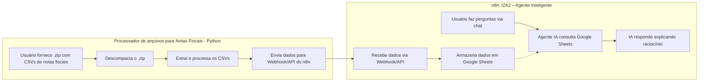

# 2025-Agentes
Repositório para elaboração dos projetos do Grupo 2 - IntelligenceI2A2, do curso Agentes Autônomos com Redes Generativas

---

# Desafio 04 - Agente de Processamento de VR

Este projeto implementa um agente inteligente para processamento de dados de Vale Refeição (VR) utilizando modelos LLM (LLaMA/Mistral) e o framework LangChain. O agente automatiza a leitura, validação e processamento de planilhas Excel, gerando relatórios mensais de VR.

## Estrutura do Projeto

- `main.py`: Ponto de entrada do sistema.
- `agente_vr.py`: Implementação do agente LLM com ferramentas estruturadas.
- `carregamento.py`: Responsável por carregar e limpar as planilhas de entrada.
- `processamento.py`: Implementa as regras de negócio e cálculos do VR.
- Planilhas de entrada (devem estar na pasta informada via parâmetro):
- `dados`: Pasta com planilhas de entrada (.xlsx).
  - `ATIVOS.xlsx`
  - `ADMISSÃO ABRIL.xlsx`
  - `FÉRIAS.xlsx`
  - `DESLIGADOS.xlsx`
  - `AFASTAMENTOS.xlsx`
  - `APRENDIZ.xlsx`
  - `ESTÁGIO.xlsx`
  - `EXTERIOR.xlsx`
  - `Base dias uteis.xlsx`
  - `Base sindicato x valor.xlsx`
- `saida`: Pasta de saída para o relatório gerado.

## Requisitos

- Python 3.10+
- Modelos LLaMA/Mistral em formato GGUF

## Instalação

1. Clone o repositório ou copie os arquivos para uma pasta local.
2. Instale as dependências:
   ```bash
   pip install pandas numpy
   ```

## Como Executar

1. Certifique-se de que todas as planilhas de entrada estejam na mesma pasta.
2. Execute o script principal informando o diretório das planilhas e o caminho do arquivo de saída:

   ```bash
   python main.py --model /caminho/para/modelo.gguf --base-dir dados/ --out saida/VR_MENSAL_CALCULADA.xlsx
   ```
   
   - `model`: Caminho para a pasta onde esta o modelo.
   - `--base-dir`: Caminho para a pasta onde estão as planilhas de entrada.
   - `--out`: Caminho completo do arquivo Excel de saída que será gerado.

## Fluxo do Programa

1. **Carregamento:** As planilhas são carregadas e limpas pelo módulo `carregamento.py`.
2. **Processamento:** O módulo `processamento.py` aplica as regras de negócio, realiza cálculos de dias e valores de VR, e gera o DataFrame final.
3. **Saída:** O relatório consolidado é salvo em Excel no caminho especificado.

## Observações

- O modelo LLaMA/Mistral deve estar disponível no caminho informado.

- Link para realizar o download do modelo: https://huggingface.co/TheBloke/Mistral-7B-Instruct-v0.2-GGUF

## Licença

Este projeto é apenas para fins de estudo/desafio.

---

# Desafio 02 - Agentes Autônomos – Análise de CSV



## Projeto: Processador de arquivos para Notas Fiscais (.zip com CSVs)

Este projeto em Python tem como objetivo ler um arquivo `.zip` contendo dois arquivos CSV com dados de notas fiscais, descompactar, processar e enviar essas informações para um webhook no n8n.

---

## Estrutura do Projeto

```
processador_arquivos/
├── .venv/                      # Ambiente virtual Python (recomendado)
├── dados_extraidos/            # Diretório onde os CSVs são extraídos
├── 202401_NFs.zip              # Arquivo .zip com os CSVs (cabeçalho e itens)
├── main.py                     # Arquivo principal que roda o processo
├── leitor_zip.py               # Classe que processa os dados do .zip e monta os objetos
├── integrador_api.py           # Classe que envia os dados para a API REST
├── requirements.txt            # Dependências Python
└── README.md                   # Documentação do projeto
```

---

## Requisitos Python

* Python 3.10+
* pip
* Ambiente virtual (opcional, mas recomendado)

### Instalar dependências:

```bash
python -m venv .venv
source .venv/bin/activate  # Linux/Mac
.venv\Scripts\activate     # Windows
pip install -r requirements.txt
```

## Como executar o projeto

Com o ambiente ativo e os arquivos preparados:

```bash
python main.py
```

Isso fará:

1. A leitura do arquivo `.zip`
2. A extração dos dois arquivos `.csv`
3. A montagem dos dados em objetos Python
4. O envio dos dados para o webhoot no n8n

---

## 📌 Observações

* Os arquivos CSV devem seguir a estrutura de cabeçalho e itens com coluna comum `chave_de_acesso`
* Os dados são convertidos para objetos e enviados em JSON para a API

---

## Projeto: n8n: I2A2 – Agente Inteligente para Notas Fiscais
Este fluxo implementa um agente conversacional inteligente para análise de notas fiscais, utilizando o n8n, Google Sheets e IA generativa.

## Funcionalidade

- Permite ao usuário fazer perguntas sobre notas fiscais (ex: "Qual o valor total para o CFOP 6906?").
- O agente de IA consulta as planilhas Google Sheets conectadas, realiza os cálculos/filtros necessários e responde explicando o raciocínio.
- As respostas são sempre baseadas apenas nos dados das planilhas, sem inventar informações.

## Componentes principais

- **When chat message received**: Recebe perguntas do usuário via chat.
- **AI Agent**: Agente de IA configurado para responder como especialista contábil, consultando a base `notas2`.
- **Notas2**: Ferramenta que conecta o agente de IA às planilhas Google Sheets.
- **Google Sheets1/2**: Planilhas com os dados das notas fiscais (cabeçalho e itens).
- **Webhook**: Permite atualização dos dados das planilhas via requisições externas.

## Como funciona

1. O usuário envia uma pergunta pelo chat.
2. O agente de IA interpreta a pergunta, consulta as planilhas Google Sheets, aplica os filtros/cálculos necessários e gera uma resposta explicando o raciocínio.
3. A resposta é enviada ao usuário, sempre baseada nos dados reais das planilhas.

## Exemplo de uso

Pergunta:  
> Qual o valor total das notas fiscais com CFOP 6906?

Resposta esperada:  
🧠 Linha de raciocínio utilizada:  
1. Filtrei as notas fiscais com CFOP 6906.  
2. Somei os valores do campo `VALOR TOTAL`.  
3. O valor total resultante foi R$ X.XXX,XX.

✅ Resposta final:  
O valor total das notas fiscais com CFOP 6906 é **R$ X.XXX,XX**.

## Observações

- O agente só responde com base nos dados das planilhas conectadas.
- Se faltar informação para responder, o agente orienta o usuário sobre o que está faltando.

---


